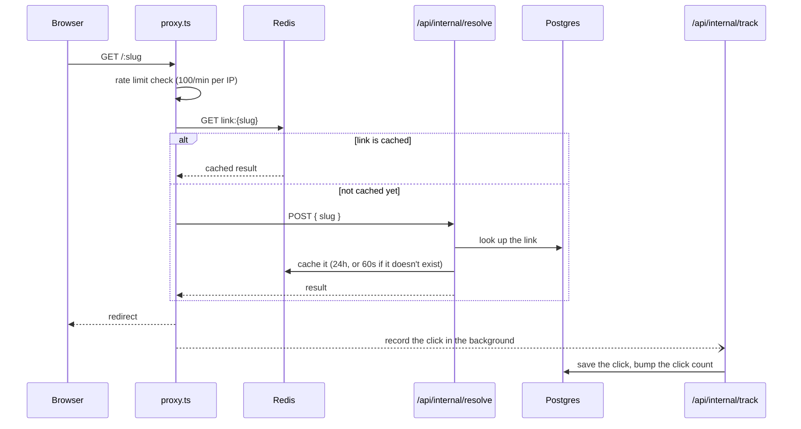

# Snip

Snip is a URL shortener. You give it a long link, it gives you a short one, and it shows you who clicked it and when. It's built the way a real product would be — fast redirects, real analytics, a public API, rate limits, and basic security — not a weekend toy.

Built with Next.js 16, Postgres (via Prisma 7), and Redis.

## What it does

- Create short links with an auto-generated or custom slug, with an optional expiry date
- Redirects are served from a cache first, so most visits never touch the database (see [How redirects work](#how-redirects-work))
- Every click is recorded in the background — user agent, rough location, referrer, and a daily-rotating hashed IP (never the raw IP)
- A dashboard with search, pagination, and per-link charts (clicks over time, referrers, devices, countries)
- Downloadable QR codes for every link
- Organizations: share links, domains, and API keys with a team instead of owning everything as one person (see [Organizations](#organizations))
- Custom domains: attach your own domain to a link instead of the shared default (see [Custom domains](#custom-domains))
- A public API (`/api/v1/*`) authenticated with API keys — keys are hashed in storage and shown to you in full exactly once
- Rate limits on redirects, link creation, and the API
- A no-login demo on the landing page: shorten one link without an account (rate-limited, expires after 24 hours)
- Security headers (CSP and friends) on every page
- Structured error logs, with a health check that catches a broken background job before it fails silently
- Dark mode

## How redirects work

The redirect is the one part of this app that runs on every single visit, so it's built to avoid the database as much as possible:



In plain terms: a link that's already been visited recently is served straight from Redis, with no database query at all. A link nobody's visited in a while gets looked up once in Postgres, and that result is cached for next time. Either way, the visitor gets redirected immediately — recording the click happens *after* the redirect is already sent, so a slow or failed write to the database can never delay someone's redirect. We proved this with a real browser test: the network tab only ever shows the redirect itself, never the tracking request, because it happens entirely on the server.

Analytics are handled separately from the redirect path. Once a day, a background job takes yesterday's raw clicks and rolls them up into small daily summaries, then deletes raw click records older than 30 days. That's what keeps the dashboard fast even as click history grows — it reads a handful of summary rows instead of scanning every individual click.

If that daily job ever silently stops running — quota limit, an outage, a bug — nothing about the dashboard would tell you. So there's a small health check for it: `GET /api/cron/aggregate/health` reports whether the job has run in the last day and a half. It returns `200` if healthy and `503` if it hasn't run recently or has never run — point an uptime monitor at it.

## Getting started

### You'll need

- Node.js 20.19 or newer
- A Postgres database — this project uses [Neon](https://neon.tech)
- A Redis database with a REST API — this project uses [Upstash](https://upstash.com)
- A GitHub OAuth App (create one at github.com/settings/developers) for sign-in

### Setup

```bash
git clone https://github.com/kanishksharma04/Snip.git
cd Snip
npm install
cp .env.example .env.local
```

Open `.env.local` and fill in the values — each one has a comment explaining where to get it (the table below has the full reference). Then:

```bash
npx prisma migrate dev   # sets up your database tables
npm run dev              # http://localhost:3000
```

If you want the dashboard to have real data to show instead of an empty screen:

```bash
npm run db:seed          # adds ~100,000 fake clicks across 20 links
```

### Environment variables

| Variable | What it's for | Notes |
|---|---|---|
| `DATABASE_URL` | Everything | Your Postgres connection string (pooled) |
| `DIRECT_URL` | Running migrations | A direct (non-pooled) connection string |
| `AUTH_GITHUB_ID` / `AUTH_GITHUB_SECRET` | Signing in | From a GitHub OAuth App. Local dev needs its own app, with its callback URL set to `http://localhost:3000/api/auth/callback/github` |
| `AUTH_SECRET` | Signing in | Generate one with `openssl rand -base64 33` |
| `SNIP_BASE_URL` | Building short links and QR codes | The domain this app is running on |
| `UPSTASH_REDIS_REST_URL` / `UPSTASH_REDIS_REST_TOKEN` | Redirects, caching, rate limits | From an Upstash Redis database |
| `IP_HASH_SALT` | Hashing visitor IPs | Generate one with `openssl rand -hex 32` |
| `CRON_SECRET` | Protecting the daily background job | Generate one with `openssl rand -base64 33` |
| `AUTH_TRUST_HOST` | Only if testing a production build locally | Needed to run `next build && next start` on your own machine — real deployments on Vercel don't need this |

A note on the Redis variables: this project uses a small, free Upstash plan capped at 500,000 commands a month. Usage is checked in the Upstash dashboard directly, rather than tracked inside the app — tracking it ourselves would mean an extra Redis command every time we wanted to count one, which adds load to the exact code path (redirects) this project is trying to keep fast. Instead, Snip is just careful by design: one read per cached redirect, one write when a link isn't cached yet, one delete when something changes.

### Useful commands

| Command | What it does |
|---|---|
| `npm run dev` | Start the dev server |
| `npm run build` / `npm start` | Build and run a production build |
| `npm run lint` | Run the linter |
| `npm test` | Run the unit tests |
| `npm run db:check` | Check that your database connection works |
| `npm run db:seed` | Add ~100,000 fake clicks for testing the dashboard with real-feeling data |
| `npm run test:auth-status` | Checks that signed-out users get properly redirected, and that a missing link returns a real 404. This guards against a real bug this project shipped and fixed: a loading state on one page was accidentally making *every* page under it return the wrong status code, even though it still looked correct on screen |

## Infrastructure

- **Database:** Neon Postgres, hosted in AWS's `us-east-1` region — the same region the app runs in on Vercel, so the two aren't talking to each other across the world on every request.
- **Cache:** Upstash Redis. This particular database is shared with another, unrelated project, so Snip is careful about it: every key it writes starts with `link:` and nothing else, and nothing in this codebase ever wipes the whole database or scans through all its keys — deletes always target one exact key.
- **Error tracking:** there's no Sentry (or similar) account set up for this project. Instead, `src/instrumentation.ts` uses a built-in Next.js hook to catch every unhandled server error and log it as a single line of structured JSON that Vercel's own logs already capture and let you search. Before anything is logged, URLs inside the error message are stripped down to just their domain and path — a link's destination can carry things like password-reset tokens in its query string, and those should never end up sitting in a log. If real Sentry gets added later, it plugs into this exact same hook — it should run alongside this logging, not replace it.

## How it performs

**Redirect speed.** A cold redirect (checking Postgres every time) took a median of about 480ms in production. Adding a Redis cache in front of it brought that down to about 407ms — a real improvement, but a smaller one than "caching" usually promises. The reason: this redirect runs as a small serverless function on Vercel, not as an edge function, so every request pays for spinning that function up regardless of how fast the cache read is. The cache still removes a database query from the common case, which matters — it just isn't the whole story on this hosting setup.

**Click tracking doesn't slow anything down.** We proved this with a real browser test, not just by reading the code: the browser's network tab shows only the redirect itself — never the request that records the click — because that request is fired from the server after the redirect has already been sent. Server logs confirm the redirect finished a full 1.7 seconds before the click was actually saved, with no effect on the visitor. See [`docs/redirect-waterfall.png`](docs/redirect-waterfall.png) for the actual capture.

**Why the dashboard stays fast as click history grows.** We seeded a test database with about 100,000 real click records spread across 90 days, then measured the dashboard's queries directly against Postgres (raw output: [`docs/explain-analyze-before.txt`](docs/explain-analyze-before.txt)). Reading a single day's totals stayed fast even at that size. But the "top referrers / devices / countries" breakdowns got noticeably slower as the date range widened — up to about 22ms in the worst case here, and climbing further as more clicks pile up over time, because each one has to group every raw click row in the requested range. The fix: instead of grouping raw clicks every time someone loads the dashboard, a daily background job pre-computes each day's totals once and stores the summary. After that change, the same queries dropped to under 1ms — reading roughly 30 small summary rows instead of scanning tens of thousands of individual clicks. We double-checked that the totals matched exactly between the old and new methods before trusting the faster numbers.

**A real Lighthouse audit of the dashboard** scored 89 on Performance, 98 on Accessibility, and 100 on both Best Practices and SEO. Three of the four performance sub-scores were excellent (98–100); the one that pulled the overall score under 90 was "Largest Contentful Paint," and we tracked down exactly why: a couple of seconds after the page loads, Next.js's own background prefetching briefly (and incorrectly) treats the page as signed-out, which confuses Lighthouse's measurement — not a real slow paint. Every real page load, refresh, and direct visit works correctly and quickly; this only happens on Next.js's internal background revalidation, never on an actual page view. Properly fixing it would mean changing how every protected page in this app checks who's signed in — a bigger, riskier change than was worth making at the very end of this project, so it's written up honestly here instead of hidden or quietly worked around.

## Public API

Create a key from `/dashboard/settings` — it's shown to you in full exactly once; after that, only its hash is stored. Every request below needs that key in an `Authorization: Bearer` header, and is limited to 1,000 requests per day. A key operates on whichever organization owned it at creation time (see [Organizations](#organizations)), regardless of what its creator has active later.

```bash
# Create a link
curl -X POST https://snip-blush.vercel.app/api/v1/links \
  -H "Authorization: Bearer $SNIP_API_KEY" \
  -H "Content-Type: application/json" \
  -d '{"destination": "https://example.com/hello"}'
# -> 201 {"id":"...","slug":"...","shortUrl":"https://snip-blush.vercel.app/...","destination":"https://example.com/hello","clickCount":0,"isActive":true,"expiresAt":null,"createdAt":"..."}

# List your links (page=1, limit=20 by default; limit can't go above 100)
curl "https://snip-blush.vercel.app/api/v1/links?page=1&limit=20" \
  -H "Authorization: Bearer $SNIP_API_KEY"
# -> 200 {"links":[...],"page":1,"limit":20,"total":42,"totalPages":3}

# Get stats for one link (last 30 days)
curl https://snip-blush.vercel.app/api/v1/links/{id}/stats \
  -H "Authorization: Bearer $SNIP_API_KEY"
```

A missing, wrong, or revoked key gets a `401`. Going over the daily limit gets a `429` with a `Retry-After` header telling you when to try again. These examples were all run for real against a real generated key before being written down here.

`POST /api/v1/links` also accepts an optional `domainId` — the id of one of your organization's verified domains (see below). Omit it, or leave it out entirely, to get a link on the default domain.

## Organizations

Every Snip account is a member of at least one **organization** — a personal one, created automatically the moment you sign up, with you as its only member. Links, domains, and API keys all belong to an organization, not to you directly; the dashboard always shows whichever organization you currently have active, switchable from the dropdown next to the Snip logo.

You can create additional organizations to share a set of links with other people:

- **Inviting someone is a link, not an email.** Snip has no mail provider configured — from `/dashboard/settings` → Members, an owner generates a one-time shareable URL (`/invite/{token}`, valid for 7 days) and sends it however they like. Whoever opens it, signs in, and accepts becomes a member.
- **Two roles**: `Owner` can invite, remove, and promote/demote members, rename the organization, and do everything a `Member` can. `Member` can create and manage links, domains, and API keys, but can't touch membership. There's always at least one owner — Snip refuses to remove or demote the last one, and refuses to let them leave.
- **An API key is bound to the organization it was created under for its whole lifetime** — not to whichever organization its creator happens to have active later. Creating a key under Org A, then switching your active org to B, doesn't move that key or its access anywhere.
- **Your personal organization can't be left or deleted.** It's the one guarantee that you always have somewhere to land.

What's deliberately not here: organization deletion (only rename/create/invite/remove/leave), granular per-resource permissions beyond the two roles above, and per-organization URLs — which organization's data you're looking at is a session-level switch, not part of the URL.

## Custom domains

You can attach your own domain (e.g. `go.example.com`) to links instead of using the shared default domain. This is two separate steps, and only the first one happens inside Snip:

1. **Prove you own it, inside Snip.** From `/dashboard/settings` → Domains, add the domain. Snip generates a random token and asks you to publish it as a DNS TXT record (`_snip-challenge.go.example.com`). Click Verify once it's live — Snip looks the record up directly (no third-party service involved) and marks the domain verified if it matches. This step only proves ownership *inside Snip's own database*; a verified domain becomes selectable when creating a new link.
2. **Actually route traffic there.** Snip does not call Vercel's API to attach the domain for you (this project has no `VERCEL_TOKEN` configured, and that's a deliberate choice, not an oversight). You still need to add the domain in the Vercel project's own Settings → Domains, and point your DNS at Vercel the way it asks (usually a CNAME). Until you do this, a verified-in-Snip domain simply won't receive any traffic — visiting it won't reach this app at all.

Both steps are required. A domain that's verified in Snip but never added in Vercel just sits there unused; a domain added in Vercel without ever being verified in Snip can't be selected for a link in the first place. Deleting a domain detaches any links using it back to the default domain — it doesn't delete the links themselves.

## Why some things are built this way

**Redirects use a 302, not a 301.** A 301 tells the browser "this is permanent, remember it" — so browsers and CDNs cache it and stop asking Snip at all. That would silently break click counting and make disabling or repointing a link impossible. A 302 gets checked every time, which is the whole point of a link shortener that also tracks clicks.

**Redirects still go through a cache-first design, even though it turned out not to run at the "edge."** This project originally set it up that way assuming it would run on Vercel's edge network. A real check on a deployed build showed it actually runs as a regular server function instead — the original assumption was wrong. The caching design was kept anyway, on purpose: it's still the right shape for a redirect that needs to be fast, and it still means a warm link never touches the database. What that assumption *does* change is how much of a speed win to expect — see [How it performs](#how-it-performs) above.

**Clicks are tracked as individual raw records, then rolled up into daily summaries — not summarized from the very start.** Building the summarized version first would have meant guessing at the right shape before there was real data or real usage patterns to design around. Instead, this project measured the actual cost of the slow, naive approach first, then fixed it once the numbers showed where it hurt (see [How it performs](#how-it-performs)).

**Visitor IPs are hashed with a salt that changes every day, never stored raw.** The hash combines the IP, a secret value, and today's date — so the same visitor produces a *different* hash tomorrow. That's enough to count "how many different people clicked this today" without keeping anything that could identify or track a specific person across days.

## Deployment

**Live at:** https://snip-blush.vercel.app

Deployed on Vercel, using the same Neon Postgres project as development.

### Environment variables in production

| Variable | Notes |
|---|---|
| `DATABASE_URL` / `DIRECT_URL` | Same Postgres project as development |
| `AUTH_SECRET` | A different value from local dev — the two should never share a session secret |
| `AUTH_GITHUB_ID` / `AUTH_GITHUB_SECRET` | From a **separate** GitHub OAuth App than local dev uses, since the callback URL is different |
| `SNIP_BASE_URL` | `https://snip-blush.vercel.app` |
| `UPSTASH_REDIS_REST_URL` / `UPSTASH_REDIS_REST_TOKEN` | Same shared Redis instance as development in this project's case |
| `IP_HASH_SALT` | A different value from local dev — sharing it would make IPs guessable across environments |
| `CRON_SECRET` | Must match what's configured for the scheduled job in `vercel.json` |

### Production GitHub OAuth App

- Homepage URL: `https://snip-blush.vercel.app`
- Callback URL: `https://snip-blush.vercel.app/api/auth/callback/github`

### A note on preview deployments

Every preview deployment gets its own random URL, which can't be registered as a GitHub OAuth callback ahead of time. So signing in with GitHub only works on the production domain above — previews are expected to not support sign-in, that's not a bug.
