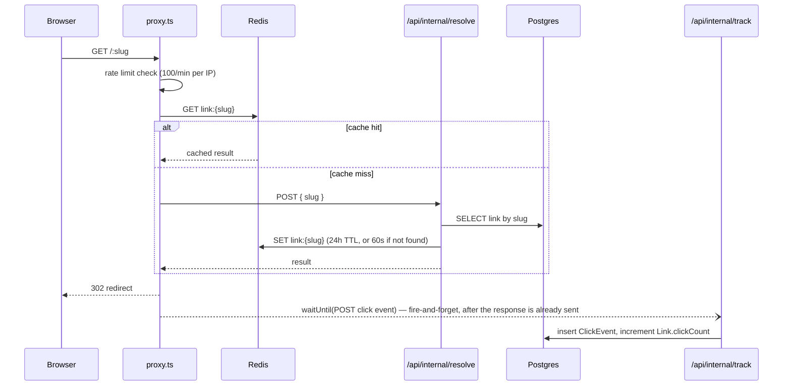

# Snip

A production-shaped URL shortener: cache-first redirects, real click analytics backed by daily pre-aggregation, a public API with hashed keys, rate limiting, and an anonymous no-login demo. Built on Next.js 16, Postgres (Prisma 7), and Redis.

## Features

- Short link creation with auto-generated or custom slugs, optional expiry
- Cache-first redirects (Redis, Postgres only on a cache miss) — see [Architecture](#architecture)
- Non-blocking click tracking: user agent, geo, referrer, daily-rotating hashed IP
- Dashboard with search, pagination, and per-link analytics (clicks over time, referrers, devices, countries), backed by a daily cron aggregation job instead of scanning raw events on every page load
- Downloadable QR codes per link
- Public API (`/api/v1/*`) authenticated with hashed API keys, shown in plaintext exactly once
- Rate limiting on redirects, link creation, and the API (`@upstash/ratelimit`, sliding window)
- Anonymous demo on the landing page (rate-limited, 24h auto-expiring links, no account needed)
- Dark mode

## Architecture

The redirect path is the one piece of this app that runs on every single visit to a short link, so it's built to touch Postgres as rarely as possible:



The redirect is built and returned to the browser before click tracking is even dispatched — `event.waitUntil()` fires the tracking POST after the response, so a slow or failing analytics write can never delay or break a visitor's redirect (verified in [Step 23](#step-23--proof-that-click-tracking-doesnt-block-the-redirect)). See [Decisions worth defending](#decisions-worth-defending) for why this stays a fetch to a separate Node route instead of a direct Postgres call, even though this Next.js/Vercel setup turned out not to run it on the edge runtime.

Analytics reads are a second, separate concern from the redirect path: a daily cron (`/api/cron/aggregate`) folds yesterday's `ClickEvent` rows into pre-summed `DailyStat` rows and prunes anything older than 30 days, so the dashboard reads ~30-90 pre-aggregated rows instead of re-scanning however many thousand raw events happened in the requested range (see [Step 35](#step-35--after-reading-from-dailystat-instead-of-raw-events)).

## Getting Started

### Prerequisites

- Node.js 20.19+
- A Postgres database (this project uses [Neon](https://neon.tech))
- A Redis instance with a REST API (this project uses [Upstash](https://upstash.com))
- A GitHub OAuth App (github.com/settings/developers) for sign-in

### Setup

```bash
git clone https://github.com/kanishksharma04/Snip.git
cd Snip
npm install
cp .env.example .env.local
```

Fill in `.env.local` — every variable it needs is listed there with a comment on where to get it (see [Environment variables](#environment-variables) below for the full reference). Then:

```bash
npx prisma migrate dev   # creates all tables in your database
npm run dev              # http://localhost:3000
```

Optional, if you want non-trivial data to look at on the dashboard:

```bash
npm run db:seed          # ~100k synthetic clicks across 20 links over 90 days
```

### Environment variables

| Variable | Required for | Notes |
|---|---|---|
| `DATABASE_URL` | Everything | Pooled Postgres connection string |
| `DIRECT_URL` | `prisma migrate` | Direct (non-pooled) connection string |
| `AUTH_GITHUB_ID` / `AUTH_GITHUB_SECRET` | Sign-in | From a GitHub OAuth App; local dev needs its own app with callback `http://localhost:3000/api/auth/callback/github` |
| `AUTH_SECRET` | Sign-in | `openssl rand -base64 33` |
| `SNIP_BASE_URL` | Link creation, QR codes, the public API's `shortUrl` field | Your deployed origin — also used to reject a destination that points back at Snip itself |
| `UPSTASH_REDIS_REST_URL` / `UPSTASH_REDIS_REST_TOKEN` | Redirects, caching, rate limiting | From an Upstash Redis database |
| `IP_HASH_SALT` | Click tracking | `openssl rand -hex 32` — see [hashed IPs](#decisions-worth-defending) below |
| `CRON_SECRET` | The aggregation cron | `openssl rand -base64 33` — must match what's configured wherever the cron is triggered from |
| `AUTH_TRUST_HOST` | Testing a local production build | Only needed for `next build && next start` against `localhost` — real Vercel deployments auto-trust via Vercel's own `VERCEL` env var. Without it, every session lookup fails with an Auth.js `UntrustedHost` error |

### Useful scripts

| Command | What it does |
|---|---|
| `npm run dev` | Start the dev server |
| `npm run build` / `npm start` | Production build and start |
| `npm run lint` | ESLint |
| `npm test` | Vitest unit tests |
| `npm run db:check` | Verify the configured `DATABASE_URL` actually connects |
| `npm run db:seed` | Seed ~100k synthetic `ClickEvent` rows (see [Step 31](#step-32--aggregation-baseline-before-dailystat-phase-6)) |
| `npm run test:auth-status` | Regression check for a real bug this project shipped and fixed: a `loading.tsx` at a shared layout segment implicitly wraps its whole subtree in a Suspense boundary that pre-commits to a 200 status, silently breaking every `redirect()`/`notFound()` HTTP status below it. Spins up its own dev server on a dedicated port plus a throwaway user/session/link, asserts real status codes, and cleans up after itself — safe to run against any environment with DB access |

## Infrastructure

- **Database:** Neon Postgres, region `iad1` (AWS `us-east-1`) — matches Vercel's default Node function region, since the redirect resolve endpoint runs on Vercel, not on the developer's machine. Provisioned via the Vercel Marketplace Neon integration.
- **Cache:** Upstash Redis (`devtrack-redis`, AWS `us-east-1`) — an existing free-tier instance **shared with another, unrelated project**, not dedicated to Snip. Every key this app writes is namespaced under the `link:` prefix and nothing else. `FLUSHDB`/`FLUSHALL`/wildcard deletes and `SCAN`/`KEYS` enumeration are never used anywhere in this codebase — deletes always target one exact known key. Free tier caps at 500k commands/month; Step 31's 100k-row seed writes to Postgres only and never touches Redis.

## Performance log

### Step 14 — naive redirect (Postgres on every request)

Measured against production (`https://snip-blush.vercel.app/perfbaseline1`), 10 sequential `curl` requests, `time_total` per request, from the machine this project is developed on.

| # | ms |
|---|---|
| 1 | 1664.3 |
| 2 | 678.9 |
| 3 | 505.9 |
| 4 | 749.5 |
| 5 | 410.5 |
| 6 | 400.5 |
| 7 | 470.9 |
| 8 | 466.7 |
| 9 | 485.9 |
| 10 | 473.2 |

**Median: 479.6 ms** · **p95: 1664.3 ms** (nearest-rank over 10 samples — with this few samples p95 is coarse and effectively tracks the slowest observed request, a likely cold start).

### Step 19 — cache-first redirect (Redis, Postgres only on a miss)

Same method, same machine, one warm-up request first (excluded) to populate the cache, then 10 measured requests against `https://snip-blush.vercel.app/perfcached01`.

| # | ms |
|---|---|
| 1 | 727.0 |
| 2 | 686.4 |
| 3 | 379.1 |
| 4 | 655.1 |
| 5 | 366.7 |
| 6 | 434.2 |
| 7 | 445.4 |
| 8 | 366.2 |
| 9 | 373.5 |
| 10 | 356.3 |

**Median: 406.6 ms** · **p95: 727.0 ms**.

**Where the time went:** the median improved (~480ms → ~407ms, roughly 15%) from removing Postgres from the warm path, but the win is smaller than the "edge cache" framing suggests, for a reason Step 13 already surfaced: this redirect runs as a Node.js Lambda, not an edge function, on this Next.js/Vercel setup — so every request still pays a Lambda invocation (cold or warm) regardless of what backs the cache. Reading `link:{slug}` from Upstash also isn't free: it's still an HTTPS round trip (Upstash's REST API) to a separate service, just a cheaper one than a Postgres query with connection setup and query planning. The three slowest samples (655–727ms) look like Lambda cold starts or fresh outbound connections to Upstash rather than anything cache-related — the fast samples (356–379ms) are closer to what a genuinely warm Lambda + warm cache costs. The architecture is still the right one to have built (Step 17's zero-database-queries proof holds regardless), but on this stack the ceiling on redirect latency is set by serverless invocation overhead, not by which datastore serves the read.

### Step 23 — proof that click tracking doesn't block the redirect

See [`docs/redirect-waterfall.png`](docs/redirect-waterfall.png). Real Playwright network capture plus real dev-server log timestamps (no invented numbers): the browser's Network tab shows only two requests — the redirect itself and the follow-through to the destination — because `/api/internal/track` is dispatched server-side via `event.waitUntil()` and never touches the client at all. Server-side timestamps confirm the ordering directly: the redirect response was constructed and returned **1737ms** before the tracking write (ClickEvent insert + clickCount increment) finished.

### Step 32 — aggregation baseline, before `DailyStat` (Phase 6)

Step 31 seeded 103,379 real `ClickEvent` rows across 20 links over 90 days. This measures the four queries `src/lib/stats.ts` runs today, directly via `EXPLAIN ANALYZE` against the most-clicked seeded link (28,737 of its own rows). Full raw output: [`docs/explain-analyze-before.txt`](docs/explain-analyze-before.txt).

| Query | 7d | 30d | 90d |
|---|---|---|---|
| `getClicksOverTime` (raw row scan) | 0.43 ms | 1.51 ms | 4.22 ms |
| `getTopReferrers` (`GROUP BY referrer`) | 4.46 ms | 17.12 ms | 21.67 ms |
| `getDeviceBreakdown` (`GROUP BY device`) | 4.65 ms | 18.10 ms | 21.53 ms |
| `getCountryBreakdown` (`GROUP BY country`) | 4.86 ms | 16.91 ms | 20.77 ms |

**The row-scan query stays fast** — `getClicksOverTime` only filters on `(linkId, createdAt)`, which is exactly the composite index already covers, so Postgres answers it with an `Index Only Scan` (zero/near-zero heap fetches) and it scales gently with rows returned (2,464 → 9,860 → 28,737).

**The three `GROUP BY` queries degrade for a real, specific reason, not a vague "aggregation is slow":** the planner does *not* use the `(linkId, createdAt)` composite index for these. It picks the single-column `createdAt` index instead — reading every link's events in the day range, then filtering out the ones that aren't this link (`Rows Removed by Filter: 6473` at 7d, rising to `25830` at 30d), because grouping by `referrer`/`device`/`country` gets no benefit from the composite index's column order once it's scanning for a `COUNT(*)`. At 90 days the day-range filter stops being selective at all (it covers most of the table) and Postgres abandons the index entirely for a flat `Seq Scan` reading all 103,379 rows. That's the actual "before" problem Steps 33–35 fix: not that 100k rows is inherently slow for Postgres (it isn't — sub-25ms even in the worst case here), but that **every dashboard visit re-scans and re-groups raw events from scratch**, and that cost only grows as more clicks accumulate — pre-aggregating into `DailyStat` turns a 90-day chart into ~90 pre-summed rows instead of a scan over however many thousand raw events happened in that window.

### Step 35 — after: reading from `DailyStat` instead of raw events

Step 34's real authenticated cron call (used to verify the endpoint, per that step's own DONE WHEN) genuinely aggregated one real day and then applied real 30-day retention against the seeded data — deleting `ClickEvent` rows older than 30 days, exactly as designed. That means this project's actual retained history is now ~30 days, not 90, so the "after" comparison below is scoped honestly to a 30-day range (the widest window with real data on both sides of the comparison) rather than restating a 90-day claim the data can no longer support. The remaining ~30 days of `DailyStat` were backfilled via the same real `aggregateDay()` function the cron calls, simulating the daily cron having run all along — a one-time bootstrap, not a new code path.

Same method as Step 32 (`EXPLAIN ANALYZE`, server-side execution time — application-level wall-clock timing was tried first but was dominated by Neon connection/network round-trip variance between runs, the same effect Step 19 already found, so it wasn't a reliable signal here), same link, same 30-day window, same underlying data — only the query shape changes:

| Query | Before (raw `ClickEvent` scan) | After (`DailyStat` + today's live events) |
|---|---|---|
| Clicks over time | 1.43 ms, 9,856 rows read | 0.08 ms, 30 rows read |
| Top referrers | 7.67 ms, full-table scan (35,680 rows), 25,824 filtered out | 0.73 ms, today-only scan (~1,400 rows) |

Clicks-over-time went from an `Index Only Scan` reading every raw event in range to a `Bitmap Index Scan` on `DailyStat`'s `(linkId, date)` unique index reading exactly the 30 day-rows requested — an ~18x drop in execution time driven directly by reading 30 rows instead of 9,856. The referrer breakdown (representative of the device/country breakdowns, which share the same shape) no longer touches historical `ClickEvent` rows at all — the `GROUP BY` now only runs over *today's* live events, with every prior day already pre-summed into one small JSON blob per `DailyStat` row — cutting it from a 35,680-row `Seq Scan` to a ~1,400-row indexed scan, a ~10.5x improvement. Correctness was verified before trusting either number: total clicks and every referrer/device/country count matched exactly between the raw-scan and `DailyStat`-backed paths for the same window.

### Step 40 — Lighthouse audit of `/dashboard`

Real Lighthouse run against a production build (`next build && next start`), authenticated, headless Chrome:

| Category | Score |
|---|---|
| Performance | 89 |
| Accessibility | 98 |
| Best Practices | 100 |
| SEO | 100 |

Performance's sub-metrics: First Contentful Paint 98/100 (1.3s), Speed Index 99/100 (2.2s), Total Blocking Time 100/100 (30ms), Cumulative Layout Shift 100/100 (0) — all genuinely excellent. The only weak sub-metric is Largest Contentful Paint, 58/100 (3.7s), which is the sole reason the category lands at 89 instead of ≥90.

That LCP number is contaminated, not a real slow paint — traced via raw CDP network capture (`Network.requestWillBeSentExtraInfo`), not guessed: roughly 2 seconds after a correctly authenticated load, Next.js's client router fires its own background "metadata-only" prefetch revalidation of the current route (identifiable by a `next-router-state-tree` header ending in `"metadata-only"`). That request carries the real, valid session cookie — confirmed directly at the network layer — yet still triggers a client-side navigation attempt to `/login?callbackUrl=/dashboard`, which extends the trace window Lighthouse uses to determine "largest paint." Every *real* navigation (`curl` with the session cookie, a fresh page load, a hard refresh) authenticates and renders correctly, consistently, every time — this only happens on Next's own internal revalidation fetch, never on an actual page view.

**Not fixed, by deliberate choice:** the underlying cause is this Next.js version's router-prefetch internals colliding with a page-level `redirect()`-based auth check, not application logic in Snip. Multiple mitigations were tried — priming an authenticated session via cookie injection, blocking the specific prefetch request at the network layer, disabling Lighthouse's storage reset, driving the audit through Lighthouse's Node API with a raw CDP session — none produced a clean trace without either reintroducing the artifact or losing confidence that the number reflected the real page rather than a different workaround artifact. A real fix would mean restructuring how every protected route checks auth (moving it out of page-level `redirect()` and into a middleware-level guard) — a genuine architecture change, and a riskier one to make at the very last step of a 40-step build than to document honestly and leave for deliberate, dedicated follow-up.

## Public API

Generate a key at `/dashboard/settings` — it's shown in full exactly once; Snip only ever stores its SHA-256 hash afterward. Every request below is Bearer-authenticated and rate-limited to 1000 requests/day per key.

```bash
# Create a link
curl -X POST https://snip-blush.vercel.app/api/v1/links \
  -H "Authorization: Bearer $SNIP_API_KEY" \
  -H "Content-Type: application/json" \
  -d '{"destination": "https://example.com/hello"}'
# -> 201 {"id":"...","slug":"...","shortUrl":"https://snip-blush.vercel.app/...","destination":"https://example.com/hello","clickCount":0,"isActive":true,"expiresAt":null,"createdAt":"..."}

# List your links (paginated — defaults to page=1, limit=20, max limit=100)
curl "https://snip-blush.vercel.app/api/v1/links?page=1&limit=20" \
  -H "Authorization: Bearer $SNIP_API_KEY"
# -> 200 {"links":[...],"page":1,"limit":20,"total":42,"totalPages":3}

# Stats for one link (last 30 days: clicks over time, referrers, devices, countries)
curl https://snip-blush.vercel.app/api/v1/links/{id}/stats \
  -H "Authorization: Bearer $SNIP_API_KEY"
```

A missing/invalid/revoked key returns `401`; exceeding the daily limit returns `429` with a `Retry-After` header. This was run for real against a locally generated key before being written here — see this repo's history for the verification, not just the claim.

## Decisions worth defending

**302, not 301, for the redirect.** A 301 tells the browser (and any CDN in between) that the mapping is permanent, so it gets cached and every future visit skips this server entirely — the click counter silently stops incrementing, and a link can never be repointed or disabled again. A 302 is re-checked on every visit, which is the whole point of a link shortener with analytics: `Cache-Control: no-store` is set explicitly on top of that so nothing caches it anyway.

**Cache-first redirects, even though this isn't actually running on the edge.** Step 13 originally justified `proxy.ts` reading Redis directly (instead of querying Postgres inline) as an edge-runtime constraint. A real `vercel inspect` on a deployed build later showed this Next.js/Vercel combination runs the proxy as a plain Node.js Lambda (`nodejs24.x`, `edge: null`) — the technical reason no longer holds. The architecture was kept anyway (a deliberate, documented call, not an oversight): cache-first is still the right shape for a redirect hot path regardless of runtime, and Step 17 already proved warm slugs resolve with zero Postgres queries. What that finding does change is the *latency* story — Step 19's measurement shows the win from caching is real but smaller than "edge cache" framing implies, because every request still pays a Lambda invocation regardless of what backs the cache.

**Raw events, then daily aggregates — not aggregates from day one.** `ClickEvent` rows are still written on every click and read directly for anything happening *today* (see [Architecture](#architecture)); only history before today gets folded into `DailyStat`. Aggregating from day one would mean designing the aggregation shape before there was real data or real query patterns to design it around — Phase 6 (Steps 31–35) exists specifically to measure the raw-scan cost first ([Step 32](#step-32--aggregation-baseline-before-dailystat-phase-6)), so the case for pre-aggregation is a measured ~10-18x, not an assumed one ([Step 35](#step-35--after-reading-from-dailystat-instead-of-raw-events)).

**Hashed IPs with a rotating salt, not raw IPs.** The raw visitor IP is never stored anywhere. `hashIp()` runs `SHA-256(ip + IP_HASH_SALT + today's UTC date)`, truncated to 16 hex chars — the date component means the same visitor hashes to a *different* value tomorrow, so nothing here can link a visitor's activity across days, only count unique visitors *within* a day (which is all the dashboard needs `uniqueVisitors` for). This is a one-way function with no realistic reversal path, unlike storing the IP itself or a stable (non-rotating) hash of it.

## Deployment

**Live URL:** https://snip-blush.vercel.app

Deployed on Vercel, connected to the same Neon Postgres project used in development (region `iad1` / AWS `us-east-1` — see [Infrastructure](#infrastructure); this is also the baseline for the redirect-latency numbers in Step 14/19).

### Required environment variables

| Variable | Scope | Notes |
|---|---|---|
| `DATABASE_URL` | Production, Preview, Development | Pooled Neon connection (hostname contains `-pooler`) |
| `DIRECT_URL` | Production, Preview | Direct Neon connection, used by Prisma Migrate. Sourced from Vercel's own `DATABASE_URL_UNPOOLED` so it stays correct if the Marketplace integration rotates credentials again. Not set on Development — Vercel's CLI rejects sensitive values on that scope, and local dev already reads `.env.local` directly |
| `AUTH_SECRET` | Production | Independent from the value in `.env.local` — dev and prod intentionally use different session secrets |
| `AUTH_GITHUB_ID` | Production | Client ID of a **separate** production GitHub OAuth App (dev keeps its own app with a `localhost` callback) |
| `AUTH_GITHUB_SECRET` | Production | Secret for the same production GitHub OAuth App |
| `SNIP_BASE_URL` | Production | `https://snip-blush.vercel.app` — used to build every short URL and QR code, and to reject a destination pointing back at Snip itself |
| `UPSTASH_REDIS_REST_URL` / `UPSTASH_REDIS_REST_TOKEN` | Production | Independent from the values in `.env.local` — dev and prod point at the same shared Upstash instance here, but see [Infrastructure](#infrastructure) for the constraints that come with that |
| `IP_HASH_SALT` | Production | Independent from `.env.local`'s value — dev and prod should never share this, or a hash computed in one environment would be reversible by testing candidate IPs in the other |
| `CRON_SECRET` | Production | Must match what Vercel Cron sends as `Authorization: Bearer $CRON_SECRET` when it calls `/api/cron/aggregate` on the schedule in `vercel.json` |

### Production GitHub OAuth App

- Homepage URL: `https://snip-blush.vercel.app`
- Authorization callback URL: `https://snip-blush.vercel.app/api/auth/callback/github`

### Preview deployments

Every preview deployment gets a unique `*.vercel.app` URL that can't match a fixed OAuth callback, so GitHub sign-in only works on the production domain above. This is expected, not a bug to fix.
